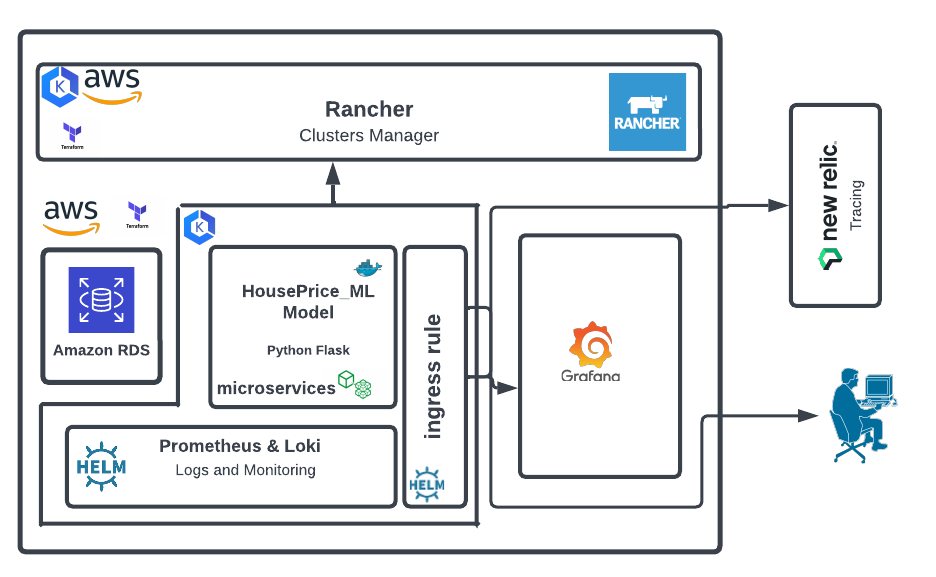
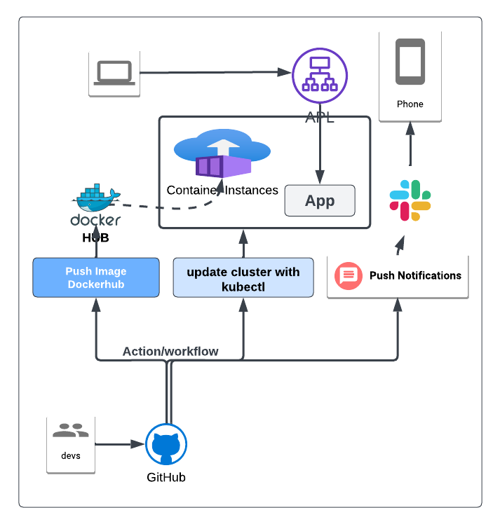

## HousePriceAI

HousePriceAI is a machine learning microservice API project that predicts housing prices in Boston. The API utilizes a pre-trained sklearn model, considering various features like average rooms, highway access, and teacher-to-pupil ratios to estimate house prices. The project focuses on containerizing the Python Flask application, app.py, which serves predictions through API calls.

## 

### Project Tasks

The main objectives of this project are:

- Perform code testing using linting to ensure code quality.
- Complete a Dockerfile for containerizing the application.
- Deploy the containerized application using Docker and make predictions.
- Configure Terraform to create Kubernetes infrastructure on AWS.
- Deploy a container using Kubernetes and validate the predictions.
- Automate the deployment process using GitHub workflow.
- Monitor and manage logs using Prometheus, Loki, and Grafana.
- Utilize Rancher for efficient cluster management.

**This project aims to showcase the seamless deployment of operationalized production microservices using Terraform, AWS EKS, and other AWS resources..**

---

## Installation

1. Clone the repository:

````
git clone git@github.com:dev-luqman/HousePriceAI_operationalizing.git
```

2. Navigate to the project directory:
````

cd HousePriceAI

````

3. Set up the Python virtual environment:
  - Create a virtualenv with Python 3.7 and activate it. Refer to this link for help on specifying the Python version in the virtualenv.

```bash
python3 -m pip install --user virtualenv
# You should have Python 3.7 available in your host.
# Check the Python path using `which python3`
# Use a command similar to this one:
python3 -m virtualenv --python=<path-to-Python3.7> .devops
source .devops/bin/activate
````

4. Install the project dependencies:

- Run `make install` to install the necessary dependencies

5. Start the Flask application:

- Standalone: `python app.py`
- Run in Docker: `./run_docker.sh`
<!-- 3. Run in Kubernetes: `./run_kubernetes.sh` -->

### Kubernetes Steps

- Create the necessary AWS EKS infrastructure using Terraform.
- Set up an AWS account.
- Build the Flask app within a container.
- Deploy the application using kubectl in conjunction with the GitHub workflow.

### Usage

To use the HousePriceAI microservice API for predicting housing prices in Boston, follow these steps:

```
./ml_app/make_prediction
```

### Github workflow



### Project folders/files description

```
.
├── .github
│   └── workflows
│       ├── deployment.yml       # Application deployment using kubectl commands
│       └── infrastructure       # Linting and infrastructural deployment using Terraform
│
├── assets                       # Asset management folder
│
├── ingress_routing
│   ├── ingress_controller.yml   # EKS ingress controller
│   └── ingress.yml              # Ingress routing to services
│
├── ml_app                       # Application folder
│   ├── assets
│   ├── app.py
│   ├── Dockerfile
│   ├── requirement.txt
│   ├── run_docker
│   ├── prediction
│   ├── upload_docker
│   └── More ...
│
├── Monitoring
│   └── README.yml               # HelmChart command for Loki and Prometheus setup
│
├── rancher                      # Cluster Management
│   ├── aws
│   └── rancher-common
│
├── terraform
│   ├── aws_backend              # Terraform backend for statement
│   └── eks_infrastructure       # EKS cluster infrastructure
│
├── pre-commit-config.yaml       # Terraform pre-commit
│
└── README.yml

```
